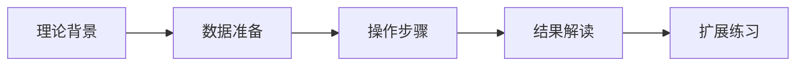

# 🌟title: "[教程主题] 领域/技术点"

## 知识定位📍
```json
{
  "前置要求": ["Python基础", "QGIS安装"],
  "学习目标": ["掌握NDVI计算方法", "理解作物物候特征"],
  "知识图谱节点": "Agriculture/RemoteSensing/Basic"
}
```

## 内容结构规划🧭


## 多媒体需求🎥
- [ ] 屏幕录制演示（Loom集成）
- [ ] 交互式代码块（Jupyter+Binder）
- [ ] QGIS处理模型导出

## 自动化发布📄 
> 本教程将通过GitBook自动发布到：
> - 网页版：https://learn.agri.org🌐
> - 微信小程序：扫码预览📱
> - PDF手册：每周自动构建
