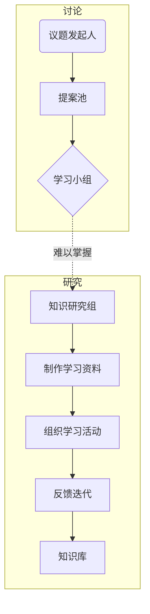

# 智枭（Knowledge Owl）学习小组

这是一个知识共建型的学习小组📖，目的是在 2025 年 6 月 30 日🕐前初步构建一套农艺🌱 + 遥感🛰️ + 作物模型📊的数据分析工作流和知识库💡。

## 仓库结构📦
```
KnowledgeOwl/
├── assets/                   # 静态资源
├── agronomy/                 # 农艺模块
├── remote_sensing/           # 遥感模块
├── crop_models/              # 作物模型
├── utils/                    # 工具库
└── README.md                 # 项目门户
```

## 技术栈🚀 
### 核心工具 
- **项目管理**：GitHub（Web）
- **笔记管理**：Obsidian 
- **Python环境管理**：anaconda 
### 开发工具 
- **IDE**：VSCode 
- **编程语言**：Python 3.10+（主）
### 专业工具 
- **地理空间计算**：QGIS、Arcgis 
- **遥感处理**：GEE（Google Earth Engine）
- **作物建模**：APSIM（Agricultural Production Systems sIMulator） 
- **机器学习框架**：Scikit-learn 
- **数据处理和分析**：Pandas、NumPy
## 组织架构


|节点|详细内容|
|---|---|
|议题发起人|当察觉到自身存在知识缺口时，主动将问题详细阐述并发布在 issue 面板（充当提案池的作用），为后续的知识探索流程开启第一步，让知识需求得以明确呈现。|
|学习小组|成员聚焦于 issue 面板，针对发起人提出的知识缺口展开热烈讨论，大家各抒己见，通过思想的碰撞，挖掘问题的关键所在，为后续深入研究奠定基础。|
|知识研究组|仔细剖析当前知识的难点痛点，凭借专业知识与多元渠道，广泛收集与之相关且具有针对性的学习资料，致力于为解决知识缺口提供扎实的素材支撑。|
|组织学习活动|无论是采用线上便捷灵活的方式，还是线下直观互动的形式，其核心要点均在于确保整个学习过程简洁流畅、高效实用，让参与者能以最快速度汲取知识养分。|
|反馈迭代|在学习小组亲身参与实践学习活动之后，依据实践过程中的真实体验与发现的问题，及时给出具有建设性的反馈意见，推动整个知识流程不断优化升级。|
|知识库|本质为 github 仓库，它承载着知识传承与复用的重任，将零散知识有序组织，完美融入日常工作流程，成为工作中不可或缺的知识源泉，随时供人取用，提升工作效率。|
