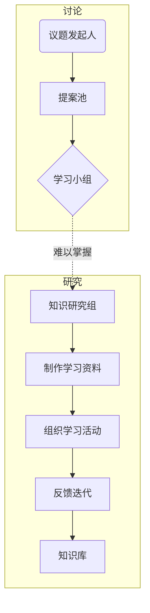

# 智枭（Knowledge Owl）学习小组🦉

这是一个知识共建型的学习小组📖，目的是在 2025 年 6 月 30 日前初步构建一套农艺🌱 + 遥感🛰️ + 作物模型📊的数据分析工作流和知识库💡。

## 快速开始🚀

1. **了解项目脉络**  
   → 📖 访问[项目Wiki](https://github.com/nwafufhy/KnowledgeOwl/wiki)获取入门指南  
   → 🗺️ 查看[仓库结构](#仓库结构)理解模块划分

2. **参与知识共建**  
   👥 加入讨论：
   - 进入 [Discussions 面板](https://github.com/nwafufhy/KnowledgeOwl/discussions) 查看最新技术探讨 
   - 点击顶部 [Issues 面板](https://github.com/nwafufhy/KnowledgeOwl/issues) 查看现有议题  
   - 在感兴趣的议题下用"/cc @yourname" 认领任务  
   - 💡 小贴士：点击页面右上角 Watch 按钮接收更新通知

3. **开启你的贡献**  
   🛠️ 初次贡献建议：  
   1. 点击仓库 [Wiki](https://github.com/nwafufhy/KnowledgeOwl/wiki) 右上角 "Suggest edits" 修正文档错漏  
   2. 在 [Discussions](https://github.com/nwafufhy/KnowledgeOwl/discussions) 板块回答其他成员的问题  
   3. 点击 [Projects](https://github.com/users/nwafufhy/projects/3) 看板了解当前任务进度

4. **发起新议题**💬  
🎯 使用标准化模板：  
   点击 Issues → New issue → 选择[🧠知识缺口提案](https://github.com/nwafufhy/KnowledgeOwl/issues/new/choose)模板  
   填写完整后 @项目管理员 进入评审流程

### 高效协作提示：
🔔 **订阅更新**  
   点击仓库右上角 Watch → Custom → 勾选 Issues 和 Discussions 选项

📌 **推荐起点**  
   - 查看带 [⚙️教程开发](https://github.com/nwafufhy/KnowledgeOwl/issues?q=is%3Aissue%20state%3Aopen%20label%3A%E2%9A%99%EF%B8%8F%E6%95%99%E7%A8%8B%E5%BC%80%E5%8F%91") 标签的议题,并谈论你对该议题的想法
     - 💡 小贴士：在 issue 讨论中，你可以使用 "/cc @yourname" 命令来请求特定成员参与讨论
     - 比如你可以说自己想迫切地学习该知识，或者觉得该知识点不重要，请求忽略该议题
   - 参与 [新人引导讨论](https://github.com/nwafufhy/KnowledgeOwl/discussions/1) 获取个性化建议

## 仓库结构📦
```
KnowledgeOwl/
├── assets/                   # 静态资源
├── agronomy/                 # 农艺模块
├── remote_sensing/           # 遥感模块
├── crop_models/              # 作物模型
├── utils/                    # 工具库
└── README.md                 # 项目门户
```

## 技术栈⚙️ 
### 核心工具 
- **项目管理**：GitHub（Web）
- **笔记管理**：Obsidian 
- **Python环境管理**：anaconda 
### 开发工具 
- **IDE**：VSCode 
- **编程语言**：Python 3.10+（主）
### 专业工具 
- **地理空间计算**：QGIS、Arcgis 
- **遥感处理**：GEE（Google Earth Engine）
- **作物建模**：APSIM（Agricultural Production Systems sIMulator） 
- **机器学习框架**：Scikit-learn 
- **数据处理和分析**：Pandas、NumPy
## 组织架构


|节点|详细内容|
|---|---|
|议题发起人|当察觉到自身存在知识缺口时，主动将问题详细阐述并发布在 issue 面板（充当提案池的作用），为后续的知识探索流程开启第一步，让知识需求得以明确呈现。|
|学习小组|成员聚焦于 issue 面板，针对发起人提出的知识缺口展开热烈讨论，大家各抒己见，通过思想的碰撞，挖掘问题的关键所在，为后续深入研究奠定基础。|
|知识研究组|仔细剖析当前知识的难点痛点，凭借专业知识与多元渠道，广泛收集与之相关且具有针对性的学习资料，致力于为解决知识缺口提供扎实的素材支撑。|
|组织学习活动|无论是采用线上便捷灵活的方式，还是线下直观互动的形式，其核心要点均在于确保整个学习过程简洁流畅、高效实用，让参与者能以最快速度汲取知识养分。|
|反馈迭代|在学习小组亲身参与实践学习活动之后，依据实践过程中的真实体验与发现的问题，及时给出具有建设性的反馈意见，推动整个知识流程不断优化升级。|
|知识库|本质为 github 仓库，它承载着知识传承与复用的重任，将零散知识有序组织，完美融入日常工作流程，成为工作中不可或缺的知识源泉，随时供人取用，提升工作效率。|
